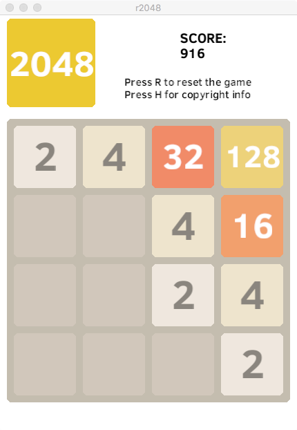

# r2048
A 2048 clone in Rust

This is a simple 2048 clone written in Rust. To compile the game, first install the Rust toolchain. Next, clone the repository. Finally, in the source directory, run cargo run --release. The code is licensed under GPL v3.0. 

This code has been tested under Mac OSX and Linux.
